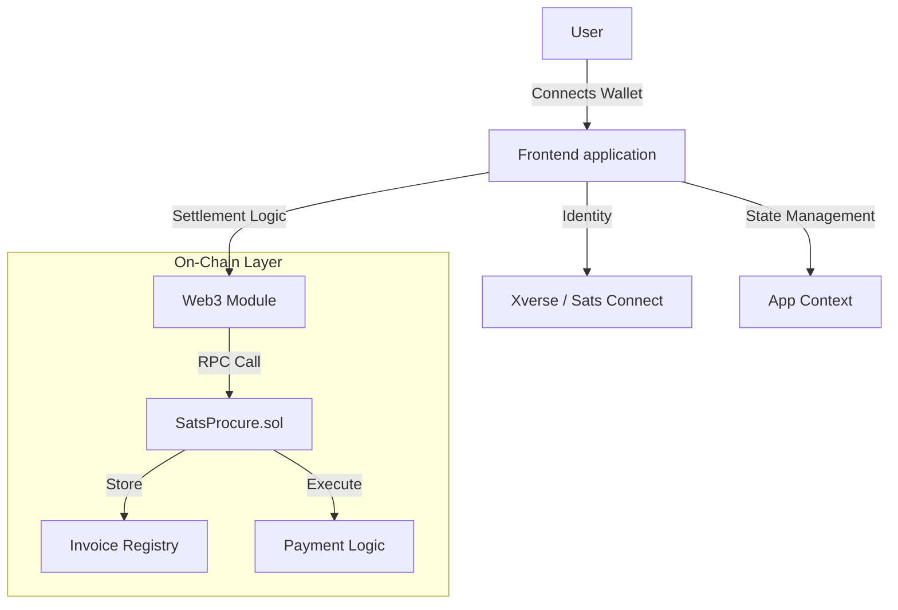

<p align="center">
  
  
  
  
  
  
</p>

# SatsProcure

**Decentralized B2B Procurement & Settlement System**

SatsProcure is a modern web application designed solely for managing inter-business procurement invoices on-chain. Built with React, TypeScript, and Tailwind CSS, it offers a transparent, secure, and automated workflow. 

The application uniquely combines **Bitcoin/Stacks wallet integration (Xverse)** for user identity/access with **EVM-compatible Smart Contracts (Midl/Ethereum)** for settlement logic, creating a hybrid architecture for demonstration purposes.

---

## 🚀 Key Features

### 🏛️ Dual Role System
- **Supplier Dashboard:** Create invoices, manage inventory items, and track payments.
- **Buyer Dashboard:** View incoming invoices, inspect item details, and execute payments.

### 📜 Invoice Management
- **Full Lifecycle:** Create -> Pending -> Paid / Cancelled.
- **Itemized Details:** Support for multiple line items with quantity and unit price (sats).
- **Simulated & Real Mode:** Works with both simulated data and real Web3 connections.

### 🔗 hybrid Web3 Architecture
- **Wallet Connection (Identity):** Integrated with **Xverse Wallet** (Sats Connect) for Bitcoin ecosystem identity.
- **Smart Contract (Settlement):** Features a Solidity Smart Contract (`SatsProcure.sol`) to handle invoice registry and payments.
- **EVM Integration:** Uses `ethers.js` to interact with the smart contract (simulated on Midl Testnet).

### 🎨 Premium UI/UX
- **Dark Mode First:** Sleek, modern design with glassmorphism and gradient accents.
- **Smooth Animations:** Custom keyframe animations for notifications and page transitions.
- **Bilingual:** One-click toggle between English and Bahasa Indonesia.

---

## 🏗️ Architecture

SatsProcure acts as a bridge between traditional procurement workflows and decentralized settlement.



### Smart Contract Logic (`contracts/SatsProcure.sol`)
1.  **createInvoice**: Registers a new invoice on the blockchain with a unique ID and amount.
2.  **payInvoice**: Buyer sends crypto (Sats/Eth) to the contract, which forwards it to the Supplier.
3.  **cancelInvoice**: Supplier can revoke unpaid invoices.

---

## 🛠️ Tech Stack

| Category | Technology | Usage |
|---|---|---|
| **Frontend** | React 19, TypeScript | Core application framework |
| **Styling** | Tailwind CSS 4 | Utility-first styling & animations |
| **Build Tool** | Vite 7 | Fast development & bundling |
| **Blockchain** | Solidity, Ethers.js | Smart Contract & Web3 Interaction |
| **Wallet** | Sats Connect, Xverse | Wallet connection standard |
| **Icons** | Lucide React | Modern, consistent iconography |

---

## 📂 Project Structure

```bash
satsprocure/
├── contracts/               # Solidity Smart Contracts
│   └── SatsProcure.sol      # Core settlement logic
├── src/
│   ├── components/          # Reusable UI Components
│   │   ├── Navbar.tsx       # Navigation & Wallet Connect
│   │   ├── RoleSelector.tsx # Landing Page
│   │   ├── Dashboard.tsx    # Main App Views
│   │   └── ...
│   ├── context/             # Global State (Context API)
│   ├── i18n/                # Localization (EN/ID)
│   ├── lib/                 # External Integrations
│   │   ├── web3.ts          # Ethers.js / Contract Calls
│   │   └── xverse.ts        # Bitcoin Wallet Logic
│   └── types/               # TypeScript Definitions
└── ...
```

---

## ⚡ Getting Started

1.  **Clone the repository**
    ```bash
    git clone https://github.com/panzauto46-bot/SatsProcure-atau-BtcInventory-.git
    cd SatsProcure-atau-BtcInventory-
    ```

2.  **Install Dependencies**
    ```bash
    npm install
    ```

3.  **Run Development Server**
    ```bash
    npm run dev
    ```
    Open `http://localhost:5173` in your browser.

4.  **Simulate Smart Contract**
    *   The app includes a "Demo Mode" fallback.
    *   To use "Real Mode", ensure you have a browser wallet (Metamask) installed and configured for the target network (Midl Testnet).

---

## 🤝 Application Flow

1.  **Connect Wallet:** Click "Connect Wallet" (defaults to Demo Mode if Xverse not found).
2.  **Choose Role:** Select **Supplier** to issue invoices or **Buyer** to pay them.
3.  **Create Invoice:** (As Supplier) Fill in buyer details and items. Click "Deploy Invoice" to interact with the Smart Contract.
4.  **Pay Invoice:** (As Buyer) Find unpaid invoices and click "Pay". The app triggers a Web3 transaction.

---

## 📄 License

Distributed under the MIT License.

---

<p align="center">
  <strong>SatsProcure</strong> — Empowering B2B Commerce on the Block(chain).
</p>
